## ✨ Introduction: Bringing Magic to Word Games with Gen AI

Hi there! I'm excited to share my project for **Google's** Generative AI Intensive Course Capstone 2025Q1 — a spellbinding word game called **SPELL**, short for **Semantic Processing Engine for Lexical Learning**. 🧙‍♀️

This project was not just about learning how to build with Google AI and LangChain — it was also a way to bring something I love into the world of generative AI: **word games**.

I've always been a fan of word games like **Squardle**, **Perquackey**, **Boggle**, and of course, **Wordle**. There’s something so satisfying about finding hidden words, solving puzzles, and stretching your vocabulary just a little further with each round.

With SPELL, I wanted to take that world and **level it up using Gen AI**. What if every puzzle had a theme you picked yourself? What if a magical AI guide greeted you at the start, helped you when you got stuck, and let you discover new vocabulary through play?

This was also a chance to **learn new tools** — like **LangGraph**, **LangChain**, and the **Gemini API** — while exploring **Kaggle** as a coding platform. My first time using them turned into an incredibly fun and rewarding experience. Not only did I build something playable, but I also got to explore how Gen AI can elevate game design, education, and creative coding.

## 🧩 Use Case: From “Fun” to “Fantastic” — Rethinking Word Games

Word games are timeless.

From board classics like **Scrabble** and **Boggle**, to app favorites like **Word Cookies**, **Wordscapes**, and daily challenges like **Wordle** or **NYT Spelling Bee**, I’ve spent countless hours solving puzzles and competing with friends.

But many word games — especially those that are offline or locked behind app paywalls — come with limitations:

### 🎮 What’s Missing in Traditional Word Games
- **Board Games** are great with friends — but can’t adapt to your interests or teach you new words.
- **App Games** often rely on ads or freemium models, limiting play or locking features.
- **Daily Word Games** give you one chance per day, with no way to keep going if you're still in the mood to play.

### 🤔 Common Frustrations
- ❌ You’re not always sure when the puzzle is complete.
- 🤷‍♀️ Missed words are rarely explained — no definitions, no feedback.
- 🔁 Puzzles are static. Replayability is limited.
- 💸 Subscriptions or ads get in the way.

### 🎯 The Vision Behind SPELL

I wanted a game that’s:
- **Fun** and full of magical personality 🧙‍♀️
- **Replayable** with new puzzles every time
- **Customizable** with themes *you* choose
- **Helpful**, with smart hints and progress tracking
- **Educational**, with a playful approach to vocabulary discovery

And that’s where **Gen AI** unlocked something truly new.

## 🧠 GenAI: A True Game-Changer

What makes SPELL magical isn’t just the wordplay — it’s how **Generative AI transforms** the experience from static to dynamic, from repetitive to responsive.

Here’s what GenAI enables that no traditional game could:

### 🎭 Personalized Puzzle Creation  
SPELL listens to **your theme idea**, and then uses **Gemini** to pick an anchor word and build a puzzle from it. Want a challenge about “volcanoes,” “opera,” or “outer space”? You got it.

### 📊 Real-Time Word Intelligence  
Each word is evaluated through a **single structured Gemini prompt**. It returns a **difficulty level**, **definition**, **example sentence**, and whether it belongs in the puzzle or should be a bonus. All returned as structured JSON.

```python
response = retry_invoke_json(prompt)
```

### 🧠 Few-Shot Prompting  
Gemini is prompted with example definitions and formats for:
- Puzzle anchor word generation
- Hints: “Give a poetic clue with the first two letters and length”
- Word enrichment (definition, sentence, difficulty)

### 🧩 Structured LangGraph State Management (Two-Phase Flow)  
SPELL is powered by **two LangGraph graphs** — one for game setup, and one for gameplay.

- The **bootstrap phase** handles everything from the AI greeting to selecting the theme and generating the anchor word.
- The **gameplay phase** handles guesses, scoring, hints, and win conditions.

```mermaid
graph TD
  start_gameplay --> get_player_guess --> process_guess --> check_win
  check_win -->|✅ Won| END
  check_win -->|❌ Keep Playing| get_player_guess
```




This separation of setup and gameplay allows better error handling, retries, and user control — while LangGraph ensures clarity and structure in the game's flow.

### 🔎 Grounding + RAG-lite Word Validation  
Before gameplay begins, SPELL uses:
- Word frequency data (e.g., `zipf_frequency`)
- WordNet definitions  
To classify words and **filter out obscure or invalid ones** before scoring or gameplay.

### 🪄 Contextual AI Hint Generation  
When you ask for help, Gemini generates a hint in real time — grounded in:
- The **remaining valid words**
- Your **guesses so far**
- The **structure of the secret word** (length, first/last letters)

This isn’t a pre-written clue. It’s dynamic and relevant, every time.

SPELL doesn’t just *use* GenAI — it **relies** on it to create, narrate, guide, score, and enrich the game from start to finish.

## 🔧 Behind the Scenes: How SPELL Works

SPELL combines structured code with magical generative moments. Here are a few implementation highlights:

### 🧩 Theme to Anchor Word Prompt
```python
prompt = f"""
You are a helpful AI assistant in a magical word game.
The player has chosen the theme: \"{theme}\"
Pick a **single common English noun** that is between **6 and 8 letters long**,
relates to the theme, and is appropriate for a word puzzle.
Return only the word (lowercase), with no extra explanation or punctuation.
"""
```

### 📊 Word Metadata (Structured JSON Output)
```json
{
  "magic": {
    "difficulty": 2,
    "definition": "Special powers that seem impossible.",
    "example": "The magician pulled a rabbit out of his hat using magic.",
    "include": true
  }
}
```

### 🪄 Hint Prompting
```python
prompt = f"""
You are a magical game guide offering hints in a word game.
Give the player a playful and mysterious clue about the word: \"{hint_word}\".
Don’t reveal the word, but describe its meaning or something fun about it.
You can include clues like length, starting and ending letters.
"""
```

### 🎉 Visual Rewards (Confetti + Final Win)
```python
if num_found == num_total and category not in state.get("rewarded_categories", []):
    render_confetti_award(category)

if guessed_words >= all_required_words and not state.get("final_reward_shown"):
    render_final_reward()
```

## 🚧 Limitations & ✨ Future Possibilities

Even magical games have their challenges — and SPELL is no exception. While it showcases the power of GenAI beautifully, there are still a few limitations and exciting frontiers ahead.

### 🔒 Current Limitations
- **Reliance on Gemini's output quality**: If Gemini returns an obscure or inappropriate anchor word, the puzzle may become unplayable. Although we’ve added retries and fallbacks, it's still a fragile point.
- **Occasional edge-case misses**: Rare words, alternate spellings, or plurals might slip through, even with filtering.
- **Text-only experience**: The game currently runs in a Jupyter notebook with basic HTML/Markdown. There’s no full web or mobile UI — yet!
- **Vocabulary backend limits**: Foundational sources like WordNet lack support for plurals, irregular nouns, and some modern words. This sometimes makes definitions feel incomplete.
- **Generative cost and API limits**: Each puzzle uses multiple Gemini API calls (e.g., for anchor word selection, metadata, and hinting). If this were a high-traffic game, costs and rate limits could be a concern.
- **User Experience (UX)**: It’s functional, but the interface could be more intuitive, polished, and delightful for casual players.

### 🛠️ What’s Next? Dreaming Bigger
- **🕸️ A full web-based UI**: Built with something like React or Streamlit to make gameplay seamless and accessible from any browser.
- **🧠 Multimodal Expansion**: Support for **voice input**, **image clues**, **video-based hosts**, and even **interactive hint animations**.
- **🌍 Multilingual puzzles**: Expand from English-only to support French, Spanish, Korean, and more — with language-specific vocabulary enrichment.
- **🖼️ Diagram-based hinting**: Use Gemini Pro Vision to provide visual hints (e.g., show a photo of a word the user missed).
- **📚 Smarter hint retrieval**: Integrate Wiktionary or WordNet with embeddings to serve hints based on meaning, usage, or similarity — instead of relying solely on GenAI.
- **📈 Dynamic difficulty scaling**: Adjust puzzle complexity based on past performance, streaks, or learning goals.
- **🎒 Classroom & learning mode**: Add support for teachers or learners to use SPELL in structured vocabulary practice, complete with progress reports and curated word sets.

The list of features, enhancements, and **multimodal possibilities** is so exciting — I couldn't even begin to explore them all in this version. But the roadmap is clear: SPELL could grow into an immersive, accessible, and AI-driven learning game like no other.

## 🎉 Conclusion: Try It, Tweak It, Take It Further

SPELL was a joy to build — and if you're reading this, I hope you'll consider trying it, forking it, or dreaming up your own GenAI-powered games.

I came into this capstone as a word game lover, not a GenAI expert. But thanks to tools like **LangChain**, **LangGraph**, and the **Gemini API**, I built a fully interactive puzzle experience that reacts to the user, guides the game, and even teaches vocabulary.

And I didn’t do it alone: I had help from **ChatGPT**, **Gemini**, and the amazing mentors, organizers, and teachers who built this **Generative AI Intensive Course**. THANK YOU. 🙏

This project helped me learn, laugh, debug, and most importantly — **play**. If I can do it, you absolutely can too.

🧪 Go forth and build!

🎮✨

